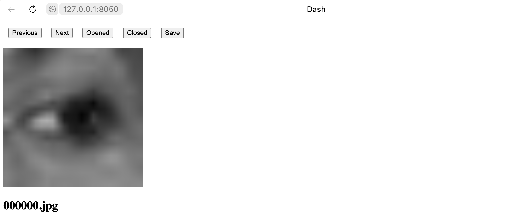

# BinarMarker

Application for binary classification of images. For example opened and closed eyes.

## Table of Contents

- [Installation](#installation)
- [Usage](#usage)

## Installation
```
pip install dash
```

## Usage
1. Copy images to dataset directory.
2. Run:
```
python BinarMarker.py
```

3. Buttons:
- Previous - return to the previous image.
- Next - go to the next image.
- Opened - mark the image as Opened (label: 1).
- Closed - mark the image as Closed (label: 0).
- Save - save as json file into json directory.

